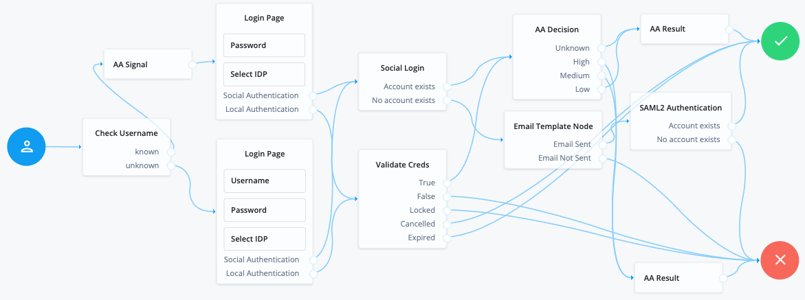

# FrodoTest - :white_check_mark: `enabled`, :purple_circle: `cloud`, :yellow_circle: `premium`
`Frodo`, `Prototype`

Frodo test journey utilizing a variety of nodes and dependencies to test support for complex journeys.

## Node Types (12)
| Count | Type | Classification |
| -----:| ---- | -------------- |
| 2 | PageNode | :green_circle: `standard` |
| 1 | product-Saml2Node | :green_circle: `standard` |
| 1 | EmailTemplateNode | :green_circle: `standard` |
| 1 | SocialProviderHandlerNode | :green_circle: `standard` |
| 1 | ScriptedDecisionNode | :green_circle: `standard` |
| 1 | IdentityStoreDecisionNode | :purple_circle: `cloud` |
| 1 | AutonomousAccessSignalNode | :purple_circle: `cloud` :yellow_circle: `premium` |
| 1 | AutonomousAccessDecisionNode | :purple_circle: `cloud` :yellow_circle: `premium` |
| 2 | AutonomousAccessResultNode | :purple_circle: `cloud` :yellow_circle: `premium` |
| 1 | ValidatedUsernameNode | :green_circle: `standard` |
| 2 | ValidatedPasswordNode | :green_circle: `standard` |
| 2 | SelectIdPNode | :green_circle: `standard` |
## Nodes (16)
| Display Name | Type | Classification | Id |
| ------------ | ---- | -------------- | ---|
| Login Page | PageNode | :green_circle: `standard` | `278bf084-9eea-46fe-8ce9-2600dde3b046` |
| SAML2 Authentication | product-Saml2Node | :green_circle: `standard` | `64157fca-bd5b-4405-a4c8-64ffd98a5461` |
| Login Page | PageNode | :green_circle: `standard` | `731c5810-020b-45c8-a7fc-3c21903ae2b3` |
| Email Template Node | EmailTemplateNode | :green_circle: `standard` | `bf153f37-83dd-4f39-aa0c-74135430242e` |
| Social Login | SocialProviderHandlerNode | :green_circle: `standard` | `d5cc2d52-6ce4-452d-85ea-3a5b50218b67` |
| Check Username | ScriptedDecisionNode | :green_circle: `standard` | `e2c39477-847a-4df2-9c5d-b449a752638b` |
| Validate Creds | IdentityStoreDecisionNode | :purple_circle: `cloud` | `fc7e47cd-c679-4211-8e05-a36654f23c67` |
| AA Signal | AutonomousAccessSignalNode | :purple_circle: `cloud` :yellow_circle: `premium` | `a8e23316-e47a-48ea-9bb0-20772aa2acda` |
| AA Decision | AutonomousAccessDecisionNode | :purple_circle: `cloud` :yellow_circle: `premium` | `fd490c13-58a4-4f5d-9ff3-302b42793c39` |
| AA Result | AutonomousAccessResultNode | :purple_circle: `cloud` :yellow_circle: `premium` | `3db2dfb3-ef88-4fdd-b4e1-f2cfb29cfeb5` |
| AA Result | AutonomousAccessResultNode | :purple_circle: `cloud` :yellow_circle: `premium` | `e918d376-a195-46da-aa9c-bda7612b40df` |
| Username | ValidatedUsernameNode | :green_circle: `standard` | `7a351800-fb7e-4145-903c-388554747556` |
| Password | ValidatedPasswordNode | :green_circle: `standard` | `804e6a68-1720-442b-926a-007e90f02782` |
| Select IDP | SelectIdPNode | :green_circle: `standard` | `228a44d5-fd78-4278-8999-fdd470ea7ebf` |
| Password | ValidatedPasswordNode | :green_circle: `standard` | `dd16c8d4-baca-4ae0-bcd8-fb98b9040524` |
| Select IDP | SelectIdPNode | :green_circle: `standard` | `038f9b2a-36b2-489b-9e03-386c9a62ea21` |
## Themes (1)
| Name | Linked Journey(s) | Id |
| ---- | ----------------- | ---|
| NoAccess | FrodoTest | `63e19668-909f-479e-83d7-be7a01cd8187` |
## Scripts (9)
| Name | Language | Type | Id |
| ---- | -------- | ---- | ---|
| Normalized Profile to Managed User | Groovy | Social Idp Profile Transformation | `58c824ae-84ed-4724-82cd-db128fc3f6c` |
| Check Username | JavaSscript | Authentication Tree Decision Node | `739bdc48-fd24-4c52-b353-88706d75558a` |
| Google Profile Normalization | Groovy | Social Idp Profile Transformation | `58d29080-4563-480b-89bb-1e7719776a21` |
| GitHub Profile Normalization | Groovy | Social Idp Profile Transformation | `23143919-6b78-40c3-b25e-beca19b229e0` |
| Facebook Profile Normalization | Groovy | Social Idp Profile Transformation | `bae1d54a-e97d-4997-aa5d-c027f21af82c` |
| Apple Profile Normalization | Groovy | Social Idp Profile Transformation | `484e6246-dbc6-4288-97e6-54e55431402e` |
| Okta Profile Normalization | Groovy | Social Idp Profile Transformation | `6325cf19-a49b-471e-8d26-7e4df76df0e2` |
| ADFS Profile Normalization (JS) | JavaSscript | Social Idp Profile Transformation | `dbe0bf9a-72aa-49d5-8483-9db147985a47` |
| Microsoft Profile Normalization | Groovy | Social Idp Profile Transformation | `73cecbfc-dad0-4395-be6a-6858ee3a80e5` |
## Email Templates (1)
| Display Name | Locale(s) | Subject | Id |
| ------------ | --------- | ------- | ---|
| welcome | en | Your account has been created | `welcome` |
## Social Identity Providers (8)
| Name/Id | Status | Type |
| ------- | ------ | ---- |
| google | :white_check_mark: `enabled` | Client configuration for Google. |
| github | :white_check_mark: `enabled` | Client configuration for providers that implement the OAuth2 specification. |
| facebook | :white_check_mark: `enabled` | Client configuration for providers that implement the OAuth2 specification. |
| apple-stoyan | :white_check_mark: `enabled` | Client configuration for Apple. |
| apple_web | :white_check_mark: `enabled` | Client configuration for Apple. |
| okta-trial-5735851 | :white_check_mark: `enabled` | Client configuration for providers that implement the OpenID Connect specification. |
| adfs | :white_check_mark: `enabled` | Client configuration for providers that implement the OpenID Connect specification. |
| azure | :white_check_mark: `enabled` | Client configuration for Microsoft. |
## SAML2 Entity Providers (2)
| Entity Id | Location | Role(s) |
| --------- | -------- | ------- |
| iSPAzure | hosted | SP |
| urn:federation:MicrosoftOnline | remote | SP |
## SAML2 Circles Of Trust (1)
| Name/Id | Status | Trusted Providers |
| ------- | ------ | ----------------- |
| AzureCOT | :white_check_mark: `active` | iSPAzure urn:federation:MicrosoftOnline https://sts.windows.net/711ffa9c-5972-4713-ace3-688c9732614a/ SPAzure https://idc.scheuber.io/am/saml2/IDPAzure |
